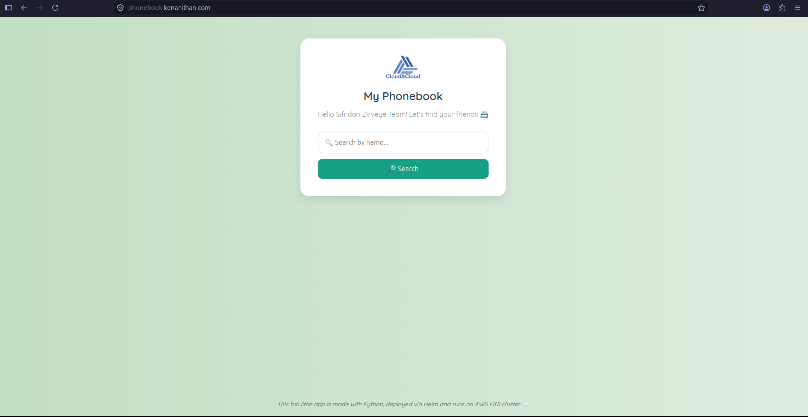
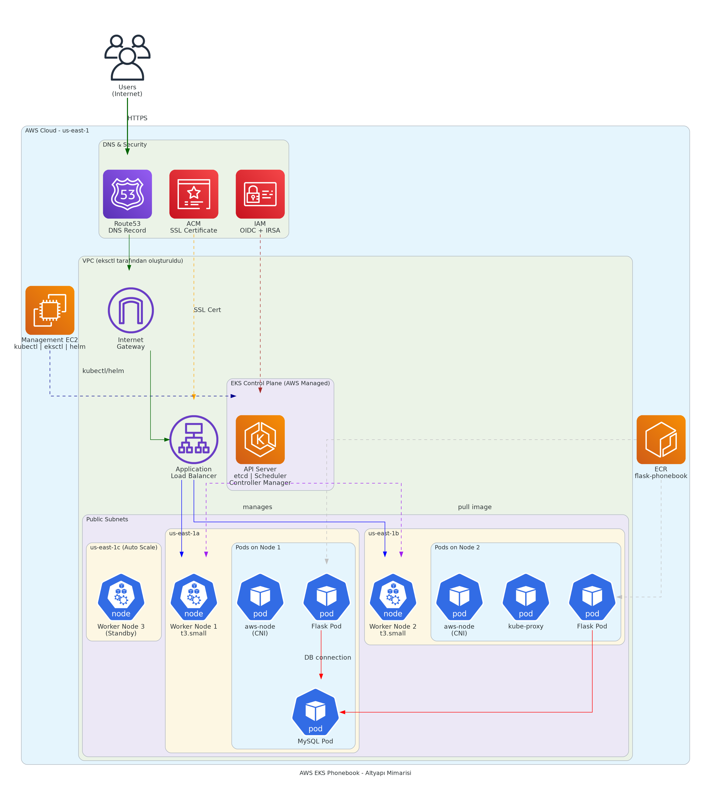

# 🚀 Flask Phonebook App on AWS EKS


A production-ready deployment of a Flask + MySQL phonebook application on Amazon EKS, using Helm, AWS LoadBalancer Controller, Route53, and ACM for HTTPS support.

---

## 📸 Application



> Live at: `https://phonebook.kenanilhan.com`

---

## 🏗️ Architecture



---

## 📋 Table of Contents

- [Overview](#overview)
- [Technologies Used](#technologies-used)
- [Project Structure](#project-structure)
- [Prerequisites](#prerequisites)
- [Estimated Cost](#estimated-cost)
- [Getting Started](#getting-started)
  - [1. Setup Management Machine](#1-setup-management-machine)
  - [2. Create EKS Cluster](#2-create-eks-cluster)
  - [3. Install AWS LoadBalancer Controller](#3-install-aws-loadbalancer-controller)
  - [4. Push Image to ECR](#4-push-image-to-ecr)
  - [5. Deploy with Helm](#5-deploy-with-helm)
  - [6. Configure Domain & HTTPS](#6-configure-domain--https)
- [Monitoring](#monitoring)
- [Cleanup](#cleanup)

---

## Overview

This project demonstrates how to:

- Deploy a containerized Flask + MySQL application on **Amazon EKS**
- Manage Kubernetes packages with **Helm**
- Route external traffic using **AWS ALB Ingress Controller**
- Secure the application with **HTTPS via ACM**
- Manage DNS with **Route53**

---

## Technologies Used

| Tool / Service | Purpose |
|---|---|
| Amazon EKS | Managed Kubernetes cluster |
| kubectl | Kubernetes CLI |
| eksctl | EKS cluster management |
| Helm | Kubernetes package manager |
| AWS LoadBalancer Controller | Maps Ingress resources to ALB |
| Amazon ECR | Container image registry |
| Route53 | DNS management |
| ACM | Free SSL/TLS certificates |

---

## Project Structure

```
eks-flask-phonebook/
├── cloudformation/
│   └── docker-installation-template.yaml   # EC2 management machine setup
├── phonebook/
│   ├── Dockerfile
│   ├── docker-compose.yaml
│   ├── phonebook-app.py
│   ├── requirements.txt
│   ├── init.sql
│   └── templates/
│       └── index.html
├── flask-phonebook/                         # Helm chart
│   ├── templates/
│   │   ├── configmap.yaml
│   │   ├── flask-deployment.yaml
│   │   ├── flask-service.yaml
│   │   ├── mysql-deployment.yaml
│   │   ├── mysql-service.yaml
│   │   └── ingress.yaml
│   ├── Chart.yaml
│   └── values.yaml
├── docs/
│   ├── phonebook_infrastructure.png
│   └── app-screenshot.png
└── README.md
```

---

## Prerequisites

- An AWS account (use IAM user, not root)
- Basic knowledge of AWS Console
- Basic Docker knowledge
- Linux command line familiarity

---

## Estimated Cost

| Service | Pricing Note |
|---|---|
| EC2 (Management Machine) | ~$0.038/hour |
| EKS Cluster | $0.10/hour |
| EC2 Worker Nodes (x2 t3.small) | ~$0.04/hour |
| ALB | $0.0225/hour + data transfer |
| Route53 | $0.50/month per hosted zone |
| ACM | Free |
| ECR | First 500MB free, then $0.10/GB/month |

> ⚠️ **Always delete resources after you're done** to avoid unexpected charges.

---

## Getting Started

### 1. Setup Management Machine

Deploy the CloudFormation stack to create an EC2 instance with Docker pre-installed:

- Go to **AWS Console → CloudFormation → Create Stack**
- Upload `cloudformation/docker-installation-template.yaml`
- Stack name: `eks-management-machine`
- Select your Key Pair and a public Subnet ID

After the stack is created, connect to the EC2 instance and install required tools:

```bash
# Git & Helm
sudo dnf install git -y
curl -sSL https://raw.githubusercontent.com/helm/helm/master/scripts/get-helm-3 | bash

# kubectl
curl -O https://s3.us-west-2.amazonaws.com/amazon-eks/1.34.2/2025-11-13/bin/linux/amd64/kubectl
chmod +x ./kubectl
mkdir -p $HOME/bin && cp ./kubectl $HOME/bin/kubectl && export PATH=$HOME/bin:$PATH

# eksctl
curl -sLO "https://github.com/eksctl-io/eksctl/releases/latest/download/eksctl_$(uname -s)_amd64.tar.gz"
tar -xzf eksctl_$(uname -s)_amd64.tar.gz -C /tmp
sudo mv /tmp/eksctl /usr/local/bin
```

---

### 2. Create EKS Cluster

```bash
aws configure   # Enter your AWS credentials

eksctl create cluster \
  --name cc-cluster \
  --region us-east-1 \
  --version 1.34 \
  --zones us-east-1a,us-east-1b,us-east-1c \
  --node-type t3.small \
  --nodes 2 \
  --nodes-min 2 \
  --nodes-max 3 \
  --with-oidc \
  --managed
```

> ⏱️ This takes approximately 10–15 minutes.

Verify:
```bash
kubectl get nodes
```

---

### 3. Install AWS LoadBalancer Controller

```bash
# Download and create IAM Policy
curl -o iam_policy.json https://raw.githubusercontent.com/kubernetes-sigs/aws-load-balancer-controller/refs/heads/main/docs/install/iam_policy.json

aws iam create-policy \
  --policy-name AWSLoadBalancerControllerIAMPolicy \
  --policy-document file://iam_policy.json

# Create IAM Service Account
# Replace <YOUR_AWS_ACCOUNT_ID> with your actual account ID
eksctl create iamserviceaccount \
  --cluster cc-cluster \
  --region us-east-1 \
  --namespace kube-system \
  --name aws-load-balancer-controller \
  --role-name "AmazonEKSLoadBalancerControllerRole" \
  --attach-policy-arn arn:aws:iam::<YOUR_AWS_ACCOUNT_ID>:policy/AWSLoadBalancerControllerIAMPolicy \
  --approve

# Install via Helm
helm repo add eks https://aws.github.io/eks-charts
helm repo update

helm install aws-load-balancer-controller eks/aws-load-balancer-controller \
  -n kube-system \
  --set clusterName=cc-cluster \
  --set serviceAccount.create=false \
  --set serviceAccount.name=aws-load-balancer-controller
```

---

### 4. Push Image to ECR

```bash
# Replace <YOUR_AWS_ACCOUNT_ID> with your actual account ID
aws ecr create-repository --repository-name flask-phonebook --region us-east-1

cd ~/phonebook
sudo docker build -t flask-phonebook:latest .

aws ecr get-login-password --region us-east-1 | \
  sudo docker login --username AWS --password-stdin \
  <YOUR_AWS_ACCOUNT_ID>.dkr.ecr.us-east-1.amazonaws.com

sudo docker tag flask-phonebook:latest \
  <YOUR_AWS_ACCOUNT_ID>.dkr.ecr.us-east-1.amazonaws.com/flask-phonebook:latest

sudo docker push \
  <YOUR_AWS_ACCOUNT_ID>.dkr.ecr.us-east-1.amazonaws.com/flask-phonebook:latest
```

---

### 5. Deploy with Helm

Before deploying, update `flask-phonebook/values.yaml` with your own values:

```yaml
flask:
  image: "<YOUR_AWS_ACCOUNT_ID>.dkr.ecr.us-east-1.amazonaws.com/flask-phonebook:latest"

mysql:
  rootPassword: "<YOUR_ROOT_PASSWORD>"
  userPassword: "<YOUR_USER_PASSWORD>"

ingress:
  host: phonebook.<YOUR_DOMAIN>
  certificateArn: arn:aws:acm:us-east-1:<YOUR_AWS_ACCOUNT_ID>:certificate/<YOUR_CERT_ID>
```

Then deploy:

```bash
cd ~/flask-phonebook
helm install phonebook .

# Verify
kubectl get all
kubectl get ingress
```

To update after changes:
```bash
helm upgrade phonebook .
```

---

### 6. Configure Domain & HTTPS

1. Go to **Route53 → Hosted Zone → Create Record**
2. Record type: **A**
3. Record name: `phonebook` (or your chosen subdomain)
4. Enable **Alias** → Route traffic to **Application Load Balancer**
5. Select your region and the ALB created by Ingress
6. Click **Create records**

Make sure your ACM certificate is validated before this step.

Test by visiting: `https://phonebook.<YOUR_DOMAIN>`

---

## 📊 Monitoring (Coming Soon)

Prometheus + Grafana stack will be added to this project.

Planned metrics:
- Pod CPU / Memory usage
- HTTP request duration
- MySQL connection stats

> Branch: `feature/monitoring`

---

## Cleanup

Run these steps in order to avoid ongoing charges:

```bash
# 1. Remove Helm release (deletes all Kubernetes resources including ALB)
helm uninstall phonebook

# 2. Delete EKS cluster (also removes VPC, subnets, security groups)
eksctl delete cluster --region=us-east-1 --name=cc-cluster

# 3. Delete ECR repository
aws ecr delete-repository --repository-name flask-phonebook --region us-east-1 --force
```

Then manually:
- Delete the **Route53 A record**
- Delete the **IAM Role**: `AmazonEKSLoadBalancerControllerRole`
- Delete the **CloudFormation stack**: `eks-management-machine`

---

## 📌 Notes

- Never commit `.pem` files or secrets to GitHub
- Store sensitive values (passwords, ARNs, account IDs) outside of version control
- This project is for learning purposes; for production use, consider using AWS Secrets Manager

---

## 📄 License

MIT
